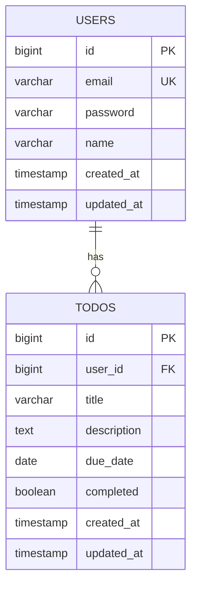
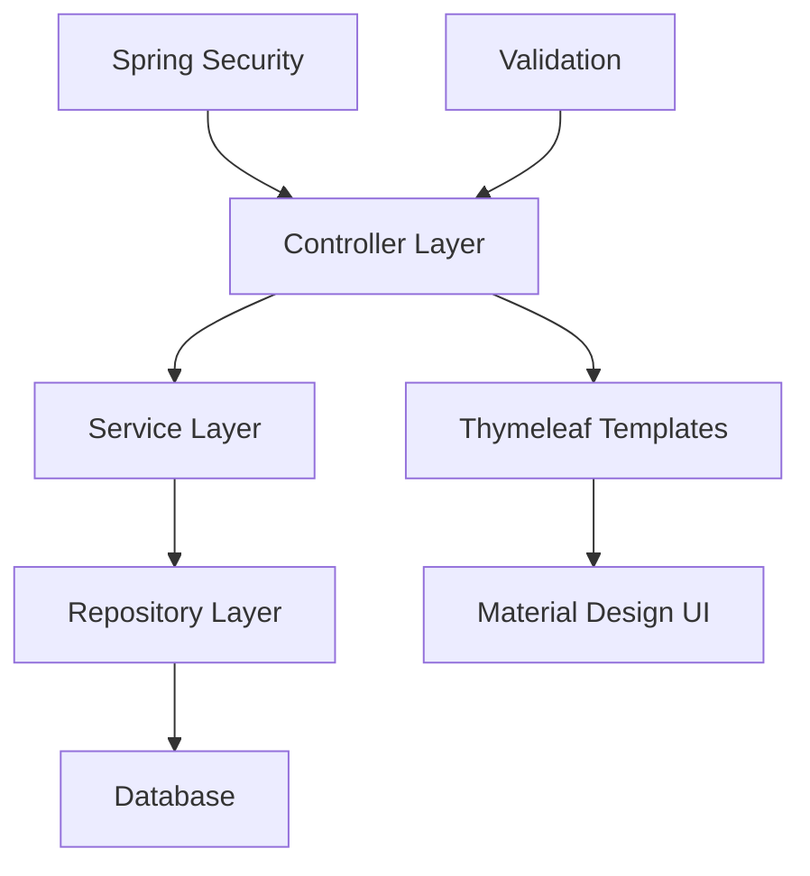

# Spring Boot ToDoアプリケーション 開発計画書

## 📋 プロジェクト概要

**技術スタック:**
- Java 17 + Spring Boot 3.5.3（最新安定版）
- Spring Security 6.x（認証・認可）
- Spring Data JPA（データアクセス）
- Thymeleaf（テンプレートエンジン）
- Material Design Lite（UI/UX）
- PostgreSQL 15+（データベース）
- Docker Compose（開発環境）
- Maven（ビルドツール）

## 🏗️ システム設計

### データベース設計



### アプリケーション構成



## 📝 詳細作業計画

### 1. プロジェクト環境の準備（Java 17 + Spring Boot 3.x + Maven）
- プロジェクトディレクトリ構造の作成
- Maven設定ファイル（pom.xml）の作成
- **最新の依存関係定義**:
  - `spring-boot-starter-web` (3.5.3)
  - `spring-boot-starter-data-jpa` (3.5.3)
  - `spring-boot-starter-security` (3.5.3)
  - `spring-boot-starter-thymeleaf` (3.5.3)
  - `spring-boot-starter-validation` (3.5.3)
  - `postgresql` (最新ドライバー)
  - `spring-boot-devtools` (開発用)

### 2. Docker Compose設定（PostgreSQL）
- PostgreSQLコンテナの設定
- 開発用データベースの初期化
- 環境変数の設定
- ポート設定（5432）
- データ永続化設定

### 3. Spring Bootプロジェクトの初期設定（最新依存関係）
- **application.yml設定**:
  - データベース接続（PostgreSQL）
  - JPA/Hibernate設定（DDL自動生成）
  - Spring Security基本設定
  - Thymeleaf設定
  - 開発用設定（DevTools）

### 4. データベース設計とエンティティクラス
- **Userエンティティ**
  - id（主キー）
  - email（ユニーク制約）
  - password（ハッシュ化）
  - name（表示名）
  - createdAt, updatedAt
- **ToDoエンティティ**
  - id（主キー）
  - title（必須）
  - description（オプション）
  - dueDate（オプション）
  - completed（完了フラグ）
  - user（外部キー）
  - createdAt, updatedAt
- JPA Repositoryの作成

### 5. Spring Securityによる認証機能
- SecurityConfigurationの作成
- UserDetailsServiceの実装
- ログイン・ログアウト機能
- セッション管理
- CSRF保護
- パスワードエンコーダー設定

### 6. ユーザー登録機能
- 新規ユーザー登録フォーム
- ユーザー登録コントローラー
- パスワードハッシュ化
- メールアドレス重複チェック
- バリデーション（メール形式、パスワード強度）

### 7. ToDoのCRUD機能実装
- **Create**: ToDo作成フォーム・処理
- **Read**: ToDo一覧表示・詳細表示
- **Update**: ToDo編集フォーム・処理
- **Delete**: ToDo削除機能
- ユーザー毎のToDo表示（認可制御）
- 完了状態の管理

### 8. ページング機能
- Spring Data JPAのPageableを使用
- 一覧画面でのページネーション
- ページサイズ設定（10件/ページ）
- ソート機能（作成日、期限日）
- 検索・フィルタリング機能

### 9. Material Design UIの実装
- Material Design Lite（MDL）の導入
- レスポンシブデザイン
- **画面設計**:
  - ログイン画面
  - ユーザー登録画面
  - ToDo一覧画面（ページング付き）
  - ToDo作成・編集画面
  - ナビゲーションバー
- ユーザーフレンドリーなインターフェース
- アクセシビリティ対応

### 10. バリデーション機能
- **フォーム入力値検証**:
  - メールアドレス形式
  - パスワード強度
  - ToDoタイトル必須
  - 期限日の妥当性
- エラーメッセージ表示
- クライアントサイド・サーバーサイド両方の検証
- セキュリティ対策（SQLインジェクション、XSS対策）

### 11. 基本テスト環境の構築（単体・統合テストのみ）
- **JUnit 5 + Spring Boot Test**の設定
- **単体テスト**:
  - Service層のテスト
  - Repository層のテスト
- **統合テスト**:
  - Controller層のテスト
  - 基本的なセキュリティテスト
- テストデータの準備
- H2インメモリデータベースを使用したテスト環境
- **除外**: パフォーマンステスト、セキュリティテスト

### 12. 動作確認とデバッグ
- 全機能の動作テスト
- 基本的なブラウザ互換性テスト
- レスポンシブデザインテスト
- エラーハンドリングの確認

## 🎯 期待される成果物

1. **完全に動作するSpring Boot 3.5.3アプリケーション**
2. **Docker Compose設定ファイル（PostgreSQL）**
3. **Material Design LiteベースのレスポンシブUI**
4. **Spring Security 6.xによるセキュアな認証システム**
5. **ページング対応のToDo管理機能**
6. **基本的なテストスイート（単体・統合テスト）**

## 📁 プロジェクト構造

```
todo-app/
├── src/
│   ├── main/
│   │   ├── java/
│   │   │   └── com/example/todoapp/
│   │   │       ├── TodoAppApplication.java
│   │   │       ├── config/
│   │   │       │   └── SecurityConfig.java
│   │   │       ├── controller/
│   │   │       │   ├── AuthController.java
│   │   │       │   └── TodoController.java
│   │   │       ├── entity/
│   │   │       │   ├── User.java
│   │   │       │   └── Todo.java
│   │   │       ├── repository/
│   │   │       │   ├── UserRepository.java
│   │   │       │   └── TodoRepository.java
│   │   │       └── service/
│   │   │           ├── UserService.java
│   │   │           └── TodoService.java
│   │   └── resources/
│   │       ├── templates/
│   │       │   ├── login.html
│   │       │   ├── register.html
│   │       │   ├── todo-list.html
│   │       │   └── todo-form.html
│   │       ├── static/
│   │       │   ├── css/
│   │       │   ├── js/
│   │       │   └── images/
│   │       └── application.yml
│   └── test/
├── docker-compose.yml
└── pom.xml
```

## 🚀 開発手順

1. 環境準備とプロジェクト作成
2. Docker環境構築
3. 基本設定とエンティティ作成
4. 認証機能実装
5. CRUD機能実装
6. UI/UX改善
7. テスト実装
8. 最終調整

この計画に基づいて、段階的に開発を進めていきます。
